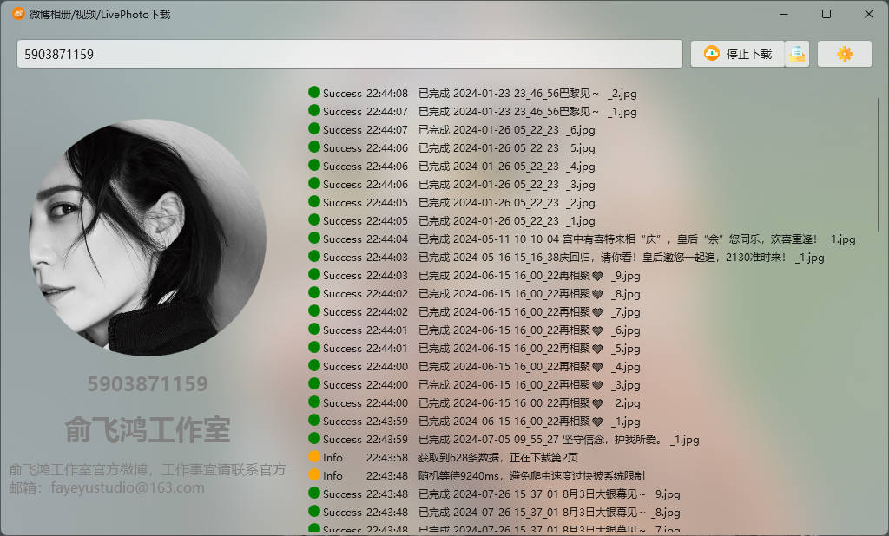

# WeiboAlbumDownloader
微博相册下载工具C#版

# 项目说明

本项目可以批量采集指定微博账号下的所有图片（视频）。

# 软件优势

开源的不开源的微博下载工具很多，但是大部分都有一个致命的缺点，就是下载的图片，并没有修改日期为发博时间。就是当我想按照日期筛选排序的时候，就很尴尬了。他们的日期一般都是默认图片下载日期，这会给使用者造成很大的困扰。

本软件基于这一点，在下载完图片后，自动获取发博时间（年月日时分秒），然后**将图片的创建日期、修改日期、访问日期都修改为发博时间**。虽然就是一个很简单的功能，但是为后期图片分析节约了大量的时间。

# 使用说明

获取微博用户uid以及web版微博Cookie，填入到软件根目录的Settings.json中即可。

如果想要在下载完发送push+通知，请填写PushPlusToken字段。不填就不发送。

如果想要开启定时任务，即在某个时间自动触发批量下载任务，那么需要填写EnableCrontab和Crontab字段。

| 字段           | 说明                                                         |
| -------------- | ------------------------------------------------------------ |
| WeiboCnCookie  | [weibo.cn](https://weibo.cn/) Cookie                         |
| WeiboComCookie | [weibo.com](https://weibo.com/) Cookie                       |
| PushPlusToken  | 推送到微信，填了就会发送                                     |
| EnableCrontab  | 否开启Crontab定时任务                                        |
| Crontab        | Crontab定时任务，例如"14 2 * * *"表示每天凌晨2点14分开始执行 |

# 数据源

数据源区分[weibo.com](https://weibo.com/) 和[weibo.cn](https://weibo.cn/) ，[weibo.com](https://weibo.com/) 是获取用户相册的数据（不包含视频），返回的是json格式。 [weibo.cn](https://weibo.cn/) 是获取的用户的时间流数据（包含视频），返回的是html格式。

对于某些用户（可能时间线很长的用户）来说，数据源选择[weibo.com](https://weibo.com/) 可能采集到之前的某一个时间点，就没有数据了。我遇到过一个用户就是这样。

还有一部分视频，无法下载，用网页访问发现无权限，暂时不知道怎么下载，以后有空再研究。

# 获取uid以及Cookie

PC打开[weibo.com](https://weibo.com/)，点击某一用户头像，进入主页。uid就是地址栏中的最后一串数字，比如https://weibo.com/u/1000000000。

按F12进入控制台，网络-全部，在名称栏选择uid，标头-请求标头-Cookie。右键复制后请填入到Seetings.json。

[weibo.com](https://weibo.com/)和[weibo.cn](https://weibo.cn/) cookie不一样，请注意区分。

# 参考

本软件的实现参考/使用了一下项目/技术：

1. [微软WPF](https://learn.microsoft.com/zh-cn/dotnet/desktop/wpf/?view=netdesktop-8.0)，本程序的基础。

2. [MicaWPF](https://github.com/Simnico99/MicaWPF)，实现窗体Mica/Acrylic效果。

3. [Newtonsoft.Json](https://www.newtonsoft.com/)，解析api返回的json数据。

4. [HtmlAgilityPack](https://html-agility-pack.net/)，解析网页返回的html数据。

5. [TimeCrontab](https://github.com/MonkSoul/TimeCrontab)，解析crontab时间数据。

6. [CronExpressionDescriptor](https://github.com/bradymholt/cron-expression-descriptor)，翻译crontab数据为可阅读的文本。

7. [Weibo Spider](https://github.com/dataabc/weiboSpider)，一个开源的很牛逼的微博爬虫。

8. [免责声明](https://github.com/JoeanAmier/TikTokDownloader/blob/master/README.md)

   

# 免责声明(Disclaimers)

- 使用者对本项目的使用由使用者自行决定，并自行承担风险。作者对使用者使用本项目所产生的任何损失、责任、或风险概不负责。
- 本项目的作者提供的代码和功能是基于现有知识和技术的开发成果。作者尽力确保代码的正确性和安全性，但不保证代码完全没有错误或缺陷。
- 使用者在任何情况下均不得将本项目的作者、贡献者或其他相关方与使用者的使用行为联系起来，或要求其对使用者使用本项目所产生的任何损失或损害负责。
- 使用者在使用本项目的代码和功能时，必须自行研究相关法律法规，并确保其使用行为合法合规。任何因违反法律法规而导致的法律责任和风险，均由使用者自行承担。
- 基于本项目进行的任何二次开发、修改或编译的程序与原创作者无关，原创作者不承担与二次开发行为或其结果相关的任何责任，使用者应自行对因二次开发可能带来的各种情况负全部责任。

**在使用本项目的代码和功能之前，请您认真考虑并接受以上免责声明。如果您对上述声明有任何疑问或不同意，请不要使用本项目的代码和功能。如果您使用了本项目的代码和功能，则视为您已完全理解并接受上述免责声明，并自愿承担使用本项目的一切风险和后果。**
